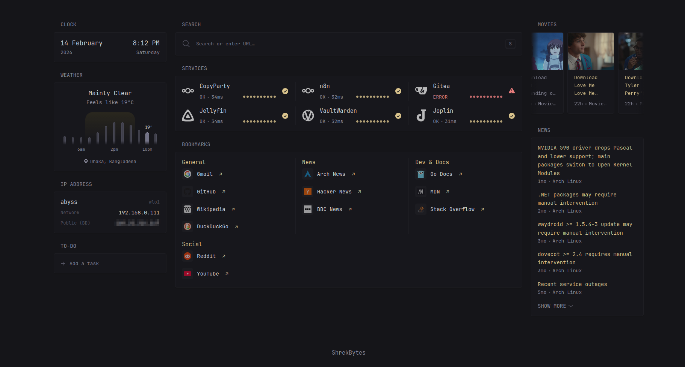

## DASH-DASH-DASH (Minimal, blazing-fast dashboard)

> **Features:** Clock • Weather • Search • Bookmarks • To-Do • RSS • Web Scraper • Service Monitoring

A lightweight, stripped-down version of [Glance](https://github.com/glanceapp/glance). Glance is more feature-rich and definitely better, but this one is just fast and minimal.




###

## Quick Links

**[Configuration Examples](quick-start/config.example.full.yml)** • **[Widget Reference](#widgets)** • **[Installation](#installation)**

###

## Table of Contents

- [Installation](#installation)
  - [Docker Compose](#docker-compose)
  - [Docker/Podman](#dockerpodman)
  - [Podman Quadlet](#podman-quadlet)
  - [Go Binary](#go-binary)
- [Configuration](#configuration)
  - [File Structure](#file-structure)
  - [Config Reference](#config-reference)
  - [Hot Reload](#hot-reload)
- [Widgets](#widgets)
  - [Clock](#clock)
  - [Calendar](#calendar)
  - [Weather](#weather)
  - [IP Address](#ip-address)
  - [To-Do](#to-do)
  - [Search](#search)
  - [Monitor](#monitor)
  - [Bookmarks](#bookmarks)
  - [RSS](#rss)
  - [Scraper](#scraper)
- [Advanced](#advanced)
  - [Widget Manual Refresh](#widget-manual-refresh)
  - [Custom CSS & Assets](#custom-css--assets)
  - [Environment Variables](#environment-variables)
  - [API Endpoints](#api-endpoints)
  - [Caching Behavior](#caching-behavior)
- [Troubleshooting](#troubleshooting)
  - [Common Issues](#common-issues)
  - [Debug Mode](#debug-mode)
  - [Getting Help](#getting-help)
- [License](#license)


###

## Installation

Default URL: **http://localhost:8080** (configurable in `config.yml`)

### Docker Compose

**Recommended method** — easiest setup and updates.

1. Create project directory:
   ```bash
   mkdir -p ~/dash-dash-dash/config
   cd ~/dash-dash-dash
   ```

2. Copy starter files:
   - [quick-start/dash-dash-dash/docker-compose.yml](quick-start/dash-dash-dash/docker-compose.yml) → `docker-compose.yml`
   - [quick-start/dash-dash-dash/config/config.yml](quick-start/dash-dash-dash/config/config.yml) → `config/config.yml`

3. Start:
   ```bash
   docker compose up -d
   ```

**Management:**
- **Stop:** `docker compose down`
- **Update:** `docker compose pull && docker compose up -d`
- **Logs:** `docker compose logs -f`

##

### Docker/Podman

1. Create project directory:
   ```bash
   mkdir -p ~/dash-dash-dash/config
   ```

2. Copy [config.yml](quick-start/dash-dash-dash/config/config.yml) → `~/dash-dash-dash/config/config.yml`

3. Run:
   ```bash
   docker run -d --name dash-dash-dash \
     --restart on-failure \
     --network host \
     -v ~/dash-dash-dash/config:/app/config:Z \
     ghcr.io/shrekbytes/dash-dash-dash:latest
   ```

Replace `docker` with `podman` if using Podman.

##

### Podman Quadlet

1. Create project directory:
   ```bash
   mkdir -p ~/dash-dash-dash/config
   mkdir -p ~/.config/containers/systemd
   ```

2. Copy files:
   - [config.yml](quick-start/dash-dash-dash/config/config.yml) → `~/dash-dash-dash/config/config.yml`
   - [dash-dash-dash.container](quick-start/dash-dash-dash/dash-dash-dash.container) → `~/.config/containers/systemd/dash-dash-dash.container`

3. Start:
   ```bash
   systemctl --user daemon-reload
   systemctl --user enable --now dash-dash-dash.service
   ```

##

### Go Binary

**Option 1: Pre-built Binary (Recommended)**

Download the latest `dash-dash-dash` binary from [Releases](https://github.com/shrekbytes/dash-dash-dash/releases).

1. Copy [config.yml](quick-start/dash-dash-dash/config/config.yml) to your working directory

2. Run directly:
   ```bash
   ./dash-dash-dash
   ```

   Or specify config path:
   ```bash
   ./dash-dash-dash -config /path/to/config.yml
   ```

**Option 2: Build from Source**

**Requirements:** Go 1.24+

1. Clone the repository:
   ```bash
   git clone https://github.com/shrekbytes/dash-dash-dash.git
   cd dash-dash-dash
   ```

2. Copy [config.yml](quick-start/dash-dash-dash/config/config.yml) to your working directory

3. Build and run:
   ```bash
   go build -o dash-dash-dash .
   ./dash-dash-dash
   ```

   Or specify config path:
   ```bash
   ./dash-dash-dash -config /path/to/config.yml
   ```

###

## Configuration

Configuration is done via a single YAML file. See [config.example.full.yml](quick-start/config.example.full.yml) for complete reference.

### File Structure

**Typical project layout:**
```
~/dash-dash-dash/
├── config/
│   ├── config.yml       # Main config (required)
│   ├── pages/           # Optional: split config
│   │   ├── home.yml
│   │   └── feeds.yml
│   └── ...
├── assets/              # Optional: custom CSS, icons, images
│   ├── user.css
│   ├── logo.png
│   └── favicon.ico
├── .env                 # Optional: environment variables
└── docker-compose.yml   # If using Docker Compose
```

**File locations:**
- **Docker/Podman:** Mount config folder to `/app/config/` (config file at `/app/config/config.yml`)
- **Go binary:** Current directory or use `-config /path/to/config.yml`

### Config Reference

#### Top-Level Sections

```yaml
server:
  host: "0.0.0.0"
  port: 8080
  base-url: http://localhost:8080
  assets-path: /path/to/assets    # Optional

document:
  head: "<meta name='...' content='...'>"    # Optional HTML in <head>

theme:
  background-color: "240 15 9"    # HSL: hue saturation lightness
  primary-color: "43 50 70"
  contrast-multiplier: 1.1
  text-saturation-multiplier: 1.0
  positive-color: "120 50 50"     # Optional
  negative-color: "0 50 50"       # Optional
  light: false                     # Light theme
  custom-css-file: /assets/user.css    # Optional

branding:
  app-name: DASH-DASH-DASH
  footer: "Your Footer Text"      # HTML or text; omit to hide
  logo-text: ""                    # Optional
  logo-url: ""                     # Optional
  favicon-url: /assets/favicon.ico # Optional
  app-icon-url: ""                 # Optional
  app-background-color: ""         # Optional

pages:
  - name: Home
    slug: ""                       # Empty = root URL (/)
    # ... see Pages section below
```

#### Pages & Columns

```yaml
pages:
  - name: Home
    slug: ""                            # URL path (empty = /)
    hide-desktop-navigation: true        # Hide top nav
    center-vertically: true
    width: default                       # default | wide | slim
    desktop-navigation-width: wide       # wide | slim
    show-mobile-header: true
    
    columns:
      - size: small                      # small | full
        widgets:
          - type: clock                  # See Widgets section
          # ... more widgets
      
      - size: full
        widgets:
          - type: search
          # ... more widgets
```

#### Variable Substitution

Use environment variables or secrets in config:

```yaml
# Environment variable
password: ${MY_PASSWORD}

# Docker secret (file at /run/secrets/db_password)
password: ${secret:db_password}

# Read file path from env var
certificate: ${readFileFromEnv:CERT_PATH}

# Escape literal $
literal: \${not-a-variable}
```

#### Config Includes

Split config into multiple files:

```yaml
# Main config.yml
pages:
  - $include: pages/home.yml
  - $include: pages/feeds.yml
```

Paths are relative to the file containing `$include`. Recursion limit: 20 levels.

### Hot Reload

Config changes apply automatically—just refresh the page. No restart needed.

**Note:** `.env` changes require restart.

###

## Widgets

All widgets share common properties:
- `type` — Widget type (required)
- `title` — Custom title
- `title-url` — Make the title a link to this URL
- `hide-header` — Hide widget header
- `css-class` — Custom CSS class
- `cache` — Cache duration override (e.g., `5m`, `1h`)

##

### Clock

Display time in multiple timezones with 12/24-hour format.

```yaml
- type: clock
  hour-format: 24h              # 12h | 24h
  timezones:                    # Optional: show additional timezones
    - timezone: America/New_York
      label: New York
    - timezone: Europe/London
      label: London
```

**Parameters:**
- `hour-format` — `12h` or `24h` (default: `24h`)
- `timezones` — List of `timezone` (IANA) and `label`

##

### Calendar

Monthly calendar view with configurable start day.

```yaml
- type: calendar
  first-day-of-week: monday     # monday | tuesday | ... | sunday
```

**Parameters:**
- `first-day-of-week` — Starting day of the week (default: `monday`)

##

### Weather

Current weather and forecast powered by [Open-Meteo](https://open-meteo.com/) (no API key required).

```yaml
- type: weather
  location: Dhaka, Bangladesh   # City, Country or City, Area, Country
  units: metric                 # metric | imperial
  hour-format: 12h              # 12h | 24h
  hide-location: false          # Hide location name
  show-area-name: false         # Show area/region in label
```

**Parameters:**
- `location` — **Required.** City and country (e.g., `"London, UK"`)
- `units` — `metric` (°C, km/h) or `imperial` (°F, mph) (default: `metric`)
- `hour-format` — `12h` or `24h` for time display
- `hide-location` — Don't show location name
- `show-area-name` — Include region/area in title

**Cache:** Updates on the hour.

##

### IP Address

Show public and local IP addresses with country information.

```yaml
- type: ip-address
  public-url: https://api.ipify.org    # Custom IP service URL
  interfaces: [wlo1, eth0]             # Filter by interface names
```

**Parameters:**
- `public-url` — IP lookup service URL (default: ipinfo.io). Set to `""` to hide public IP
- `interfaces` — Only show local IPs for these interfaces (optional)

**Cache:** 10 minutes.

##

### To-Do

Client-side to-do list with localStorage persistence.

```yaml
- type: to-do
  id: main                      # localStorage key (required)
```

**Parameters:**
- `id` — Unique identifier for localStorage (default: `default`). Use different IDs for separate lists.

##

### Search

Universal search bar with custom search engines and bangs (shortcuts).

```yaml
- type: search
  search-engine: duckduckgo     # duckduckgo | google | bing | perplexity | kagi | startpage
  placeholder: "Search or enter URL…"
  autofocus: true               # Auto-focus on page load
  new-tab: false                # Open results in new tab
  target: "_blank"              # Link target attribute
  bangs:                        # Custom search shortcuts
    - shortcut: "!yt"
      title: YouTube
      url: https://www.youtube.com/results?search_query={QUERY}
    - shortcut: "!gh"
      title: GitHub
      url: https://github.com/search?q={QUERY}
```

**Parameters:**
- `search-engine` — Built-in engine name or custom URL with `{QUERY}` placeholder
- `placeholder` — Input placeholder text
- `autofocus` — Auto-focus input on page load
- `new-tab` — Open search results in new tab
- `target` — HTML target attribute
- `bangs` — Custom shortcuts: `shortcut`, `title`, `url` (use `{QUERY}`)

**Built-in engines:** `duckduckgo`, `google`, `bing`, `perplexity`, `kagi`, `startpage`

**Usage:** Type `!yt cats` → searches YouTube for "cats"

##

### Monitor

**Service monitoring with smart connectivity detection.** Tracks uptime, response time, and status. Automatically detects local vs remote services and handles internet outages gracefully.

```yaml
- type: monitor
  title: Services
  style: compact                        # "" (default) | compact
  show-failing-only: false              # Show only failing services
  show-internet-status: true            # Show internet connectivity status
  sites:
    - title: Vaultwarden
      url: http://localhost:80          # Service URL
      icon: si:vaultwarden              # Icon (see below)
      check-url: http://localhost:80/health    # Health check URL (optional)
      timeout: 7s                        # Request timeout
      allow-insecure: false              # Skip TLS verification
      same-tab: false                    # Open in same tab
      error-url: http://localhost/status # Link when service is down
      alt-status-codes: [401, 403]       # Treat these codes as success
      basic-auth:                        # HTTP basic authentication
        username: admin
        password: ${secret:monitor_pass}
```

**Parameters:**
- `style` — Layout: `` (default) or `compact`
- `show-failing-only` — Only display services with errors
- `show-internet-status` — Display internet connection status at top (default: `false`)
- `sites` — List of services to monitor

**Per-Site Options:**
- `title` — Service name (required)
- `url` — Service URL (required)
- `icon` — Icon identifier or URL
- `check-url` — Override URL for health checks
- `timeout` — Request timeout (default: `7s`)
- `allow-insecure` — Skip TLS certificate validation
- `same-tab` — Open link in same tab
- `error-url` — Alternative URL when service is down
- `alt-status-codes` — List of HTTP codes to treat as success (besides 200)
- `basic-auth` — Username and password for authentication

**Icon Formats:**
- `si:name` — SimpleIcons (e.g., `si:docker`, `si:github`)
- `di:name` — DevIcons
- `mdi:name` — Material Design Icons
- `sh:name` — Skill Icons
- Full URL — Custom image (e.g., `/assets/logo.png`)

**Status Display:**
- `200` / `201` / etc. — HTTP status code (green if success, red if error)
- `Timeout` — Request timed out
- `Connection Error` — Network unreachable
- `Unknown` — Remote service, internet is down (gray icon)

**Cache:** 5 minutes (60 seconds during internet outage).

##

### Bookmarks

Organized bookmark groups with icons and descriptions.

```yaml
- type: bookmarks
  title: Bookmarks
  groups:
    - title: General
      color: "200 60 50"        # Optional HSL color
      same-tab: false           # Group-wide link behavior
      hide-arrow: false         # Hide arrow icon
      target: "_blank"
      links:
        - title: Gmail
          url: https://mail.google.com
          icon: si:gmail        # Icon (see Monitor section)
          description: Email    # Optional description
          same-tab: false       # Per-link override
          hide-arrow: false
          target: "_blank"
```

**Parameters:**
- `groups` — List of bookmark groups

**Group Options:**
- `title` — Group heading (required)
- `color` — HSL color for group (optional)
- `same-tab` — Open links in same tab (default for group)
- `hide-arrow` — Hide external link arrow
- `target` — HTML target attribute
- `links` — List of bookmarks

**Link Options:**
- `title` — Link text (required)
- `url` — Destination URL (required)
- `icon` — Icon (empty = favicon from URL, or use icon format from Monitor section)
- `description` — Optional subtitle text
- `same-tab` — Override group setting
- `hide-arrow` — Override group setting
- `target` — Override group target

##

### RSS

RSS/Atom feed reader with multiple display styles and aggregation.

```yaml
- type: rss
  title: News
  style: list                   # list | vertical-list | detailed-list | horizontal-cards | horizontal-cards-2
  limit: 25                     # Max items to show
  collapse-after: 5             # Show "Load more" after N items (-1 = no collapse)
  preserve-order: false         # Keep feed order (don't sort by date)
  single-line-titles: false     # Truncate titles to one line
  thumbnail-height: 200         # Card thumbnail height (only horizontal-cards-2 style)
  card-height: 300              # Card height (only horizontal-cards style)
  feeds:
    - url: https://example.com/feed.xml
      title: Custom Feed Name   # Override feed title (optional)
      limit: 10                 # Per-feed item limit (0 = use widget limit)
      hide-categories: false    # Don't show categories
      hide-description: false   # Don't show description
      item-link-prefix: ""      # Prepend to all item URLs
      headers:                  # Custom HTTP headers
        Authorization: "Bearer ${secret:api_token}"
```

**Parameters:**
- `style` — Display layout (see below)
- `limit` — Maximum total items across all feeds
- `collapse-after` — Show "Load more" button after N items (`-1` disables)
- `preserve-order` — Don't reorder by date (keep feed order)
- `single-line-titles` — Truncate long titles
- `thumbnail-height` — Thumbnail height in pixels (only for `horizontal-cards-2` style)
- `card-height` — Card height in pixels (only for `horizontal-cards` style)
- `feeds` — List of RSS/Atom feed configurations

**Per-Feed Options:**
- `url` — Feed URL (required)
- `title` — Override feed name
- `limit` — Per-feed item limit (0 = use widget limit)
- `hide-categories` — Hide category tags
- `hide-description` — Hide item description
- `item-link-prefix` — Prepend this URL to all item links (useful for privacy proxies like Nitter)
- `headers` — Custom HTTP headers for feed requests

**Display Styles:**
- `list` — Compact list without thumbnails
- `vertical-list` — Alias for `list`
- `detailed-list` — Full content with descriptions and thumbnails
- `horizontal-cards` — Horizontal scrolling cards
- `horizontal-cards-2` — Horizontal scrolling cards(thumbnail filled cards)

**Cache:** 2 hours.


###


### Scraper

Generic web scraper for extracting values from server-side rendered websites using CSS selectors. Perfect for tracking prices, download counts, statistics, or any other data from HTML pages.

```yaml
- type: scraper
  title: Web Scraper
  single-line: false            # Display all values in a single line
  show-item-titles: true        # Show item titles (auto-enabled for multiple items)
  items:
    - title: Product Price
      url: https://example.com/product
      selectors:
        - selector: ".price"
          prefix: "$"
          suffix: " USD"
        - selector: ".discount"
          prefix: "Save "
          suffix: "%"
    
    - title: GitHub Stars
      url: https://github.com/username/repo
      selectors:
        - selector: "#repo-stars-counter-star"
          suffix: " ⭐"
    
    - title: Download Link
      url: https://example.com/downloads
      selectors:
        - selector: "a.download-btn"
          attr: "href"          # Extract attribute instead of text
          prefix: "🔗 "
```

**Parameters:**
- `single-line` — Display all selector values on a single line (default: `false`)
- `show-item-titles` — Show titles for each item (default: auto-enabled for multiple items)
- `items` — List of pages to scrape (required)

**Per-Item Options:**
- `title` — Display name for this item (optional)
- `url` — Page URL to scrape (required)
- `selectors` — List of CSS selectors to extract (required)

**Per-Selector Options:**
- `selector` — CSS selector (e.g., `.price`, `#count`, `div.stats > span`) (required)
- `prefix` — Text to prepend to extracted value (optional)
- `suffix` — Text to append to extracted value (optional)
- `attr` — Extract attribute instead of text content (e.g., `href`, `src`, `data-value`) (optional)

**Selector Examples:**
- `.price` — Element with class "price"
- `#count` — Element with ID "count"
- `span.value` — `<span>` with class "value"
- `div.container > p` — Direct child `<p>` of `div.container`
- `[data-price]` — Element with attribute "data-price"
- `.product:first-child` — First element with class "product"

**Cache:** 15 minutes (configurable).

**Notes:**
- Only works with server-side rendered HTML (not JavaScript-heavy SPAs)
- Each selector extracts the first matching element from the page
- Values are automatically trimmed and whitespace-normalized
- Failed items show error messages without breaking other items
- Uses jQuery-like CSS selector syntax via goquery


###


## Advanced

### Widget Manual Refresh

Widgets that fetch external data (Weather, RSS, Monitor, IP Address) support click-to-refresh. Simply click the widget title to refresh that widget without reloading the entire page.

**Refreshable widgets:**
- **Weather** — Updates current weather and forecast
- **RSS** — Fetches latest feed items
- **Scraper** — Fetches latest scraped values
- **Monitor** — Checks service status
- **IP Address** — Updates IP information

Refreshable widget titles show hover effects (pointer cursor and color change) to indicate they are clickable.

##

### Custom CSS & Assets

Serve custom files (CSS, images, icons) from the `/assets/` endpoint.

**Setup:**

1. Create assets directory:
   ```bash
   mkdir ~/dash-dash-dash/assets
   ```

2. Reference in config:
   ```yaml
   theme:
     custom-css-file: /assets/user.css
   
   branding:
     favicon-url: /assets/favicon.ico
     logo-url: /assets/logo.png
   ```

3. Mount with Docker:
   ```yaml
   # docker-compose.yml
   volumes:
     - ~/dash-dash-dash/assets:/app/assets:ro
   ```

**Supported files:** CSS, images (PNG, JPG, SVG, WebP, GIF, ICO), fonts

##

### Environment Variables

Use environment variables for sensitive data or dynamic configuration.

**In config:**
```yaml
sites:
  - title: API
    url: ${API_URL}
    basic-auth:
      username: ${API_USER}
      password: ${secret:api_password}  # Docker secret
```

**Docker Compose:**
```yaml
# docker-compose.yml
services:
  dash-dash-dash:
    environment:
      - API_URL=https://api.example.com
      - API_USER=admin
```

Or use `.env` file:
```bash
# ~/dash-dash-dash/.env
API_URL=https://api.example.com
API_USER=admin
```

**Read file from env path:**
```yaml
certificate: ${readFileFromEnv:CERT_PATH}
```

##

### API Endpoints

**Health check:**
```bash
curl http://localhost:8080/api/healthz
# Returns 200 OK when app is healthy
```

**Page content:**
```
GET /api/pages/{page-slug}/content/
```

**Widget refresh:**
```
GET /api/widgets/{widget-id}/
```
Returns updated HTML for a specific widget. Used by the client-side manual refresh feature.

##

### Caching Behavior

| Widget | Cache Duration | Notes |
|--------|----------------|-------|
| Weather | On the hour | Updates at :00 minutes, caches location lookups |
| Monitor | 5 minutes | 60 seconds when internet is down |
| RSS | 2 hours | Per feed, supports ETag/Last-Modified for bandwidth saving |
| Scraper | 15 minutes | configurable |
| IP Address | 10 minutes | |
| Clock, Calendar, To-Do | No cache | Real-time or client-side |

**Static assets:** 24-hour cache (CSS, JS, images)


###


## Troubleshooting

### Common Issues

**Config changes not appearing**
- Ensure you're editing the correct file (mounted at `/app/config/config.yml` in containers)
- Refresh the browser (hot reload should pick up changes)
- Check logs for syntax errors: `docker logs dash-dash-dash`
- Validate config: `./dash-dash-dash config:validate`

##

**.env changes not applied**
- Restart the container: `docker compose restart`
- Environment variables are loaded at startup only

##

**Config syntax errors**
```bash
# Validate YAML syntax
./dash-dash-dash config:validate

# View merged config (includes resolved)
./dash-dash-dash config:print
```

##

**Service monitor shows all services as down**
- Check network mode: Use `--network host` for localhost access
- Verify URLs are accessible from container
- Check firewall rules
- For local services, use `host.docker.internal` instead of `localhost` (Mac/Windows)

##

**RSS feeds not loading**
- Verify feed URLs in browser
- Check for valid XML/RSS format
- Some feeds may block non-browser user agents
- Try setting custom headers:
  ```yaml
  feeds:
    - url: https://example.com/feed
      headers:
        User-Agent: "Mozilla/5.0"
  ```

##

**Slow performance**
- Reduce RSS feed count
- Use `style: list` instead of `horizontal-cards` for RSS (skips image extraction)
- Check monitor widget site count and timeouts
- Check logs for slow API responses

##

**Custom CSS not loading**
- Verify assets folder is mounted: `-v ~/dash-dash-dash/assets:/app/assets:ro`
- Check file path in config: `/assets/user.css` (not `~/dash-dash-dash/assets/...`)
- Ensure file permissions allow reading

##

**Weather widget not working**
- Verify location format: `"City, Country"` (e.g., `"London, UK"`)
- Check Open-Meteo service status
- Try different city name variations

##

### Debug Mode

View detailed logs:
```bash
# Docker Compose
docker compose logs -f

# Docker
docker logs -f dash-dash-dash

# Go binary
./dash-dash-dash  # Logs to stdout
```

##

### Getting Help

1. Check [quick-start/config.example.full.yml](quick-start/config.example.full.yml) for examples
2. Validate config: `./dash-dash-dash config:validate`
3. Review logs for error messages
4. Open an issue on GitHub

###

## License

**GNU GPL-3.0** [LICENSE](LICENSE)

###

Based on [Glance](https://github.com/glanceapp/glance) by **glanceapp**.  
Weather data: [Open-Meteo](https://open-meteo.com/) (no API key required).  
Icons: [DuckDuckGo Icons](https://icons.duckduckgo.com/), [SimpleIcons](https://simpleicons.org/).  
Font: [JetBrains Mono](https://www.jetbrains.com/lp/mono/).

###

**Built with ❤️ for minimalists.**
